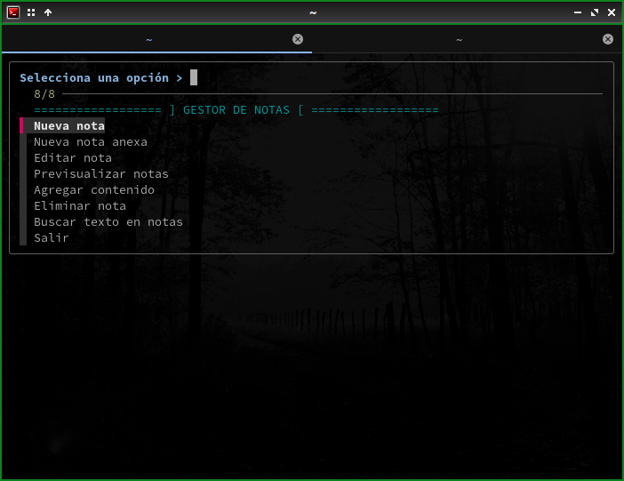
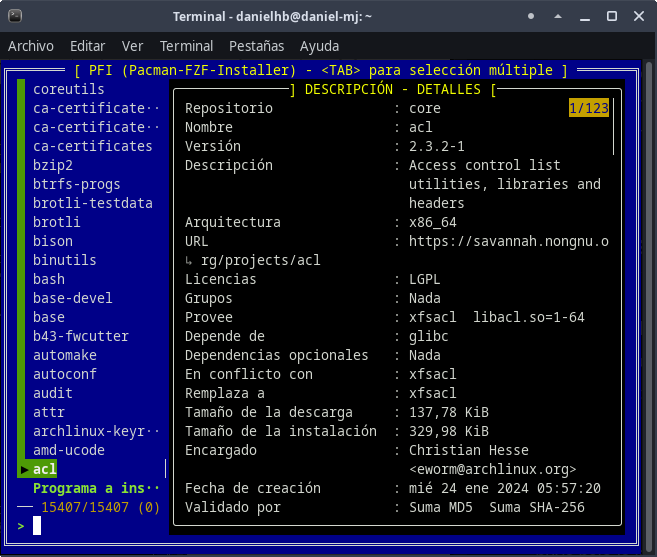

# Sólo algunos ejercicios
No soy desarrollador, sólo curioso (y torpe e ignorante).
## Algunos scripts  de práctica
- mxp : Muestra la memoria utilizada por determinado(s) programa(s).
- 
- misnotas.sh : primer ejercicio para un administrador de notas.
- 
- pfi.sh - Intento de instalador pacman con fzf.
- 

Son meras prácticas.
