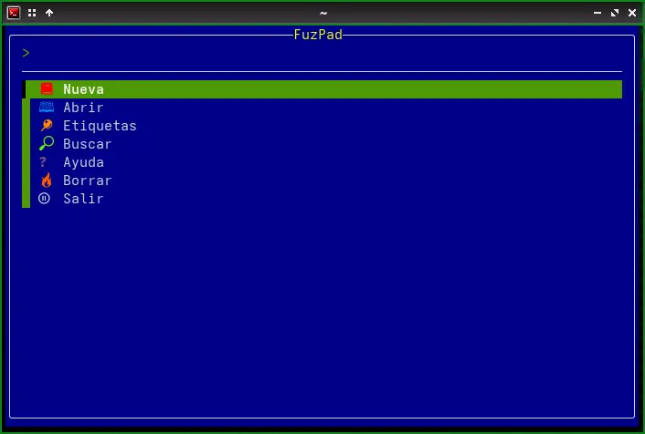
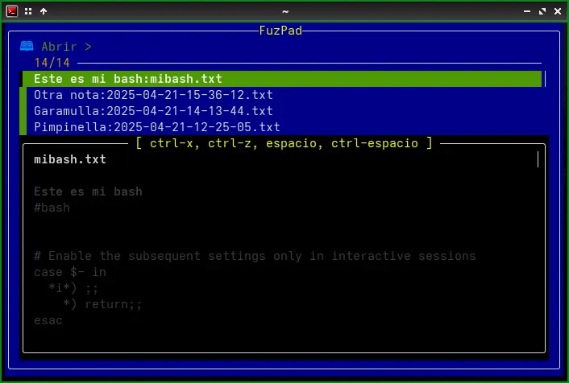
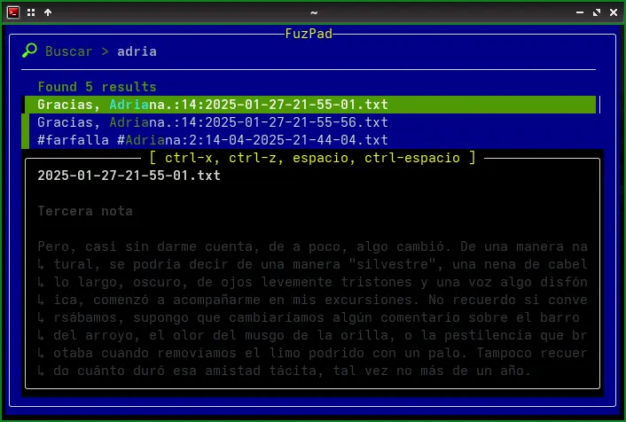

# FuzPad2: A Simple Note Manager with Fzf
(Modification of the original script by JianZcar - https://github.com/JianZcar/FuzPad)

## Overview

FuzPad is a command-line utility written in Bash that allows you to efficiently manage text notes using the fuzzy finder [fzf](https://github.com/junegunn/fzf). It provides an interactive interface to create, open, search, tag, and delete notes stored in a specific directory.

Notes are plain text files, where the first line is interpreted as the title and the second line (optional) as tags (hashtags separated by spaces). The rest of the file contains the body of the note. FuzPad facilitates the navigation and manipulation of these notes through interactive menus and previews, seamlessly integrating with your preferred text editor.

## Keyboard Shortcuts in Preview Views

During note previews (when opening, deleting, or searching), the following keyboard shortcuts are available thanks to the integration with `fzf`:

* **Space:** Scroll the preview down one line.
* **Ctrl+Space:** Scroll the preview up one line.
* **Ctrl+x:** Scroll the preview one page up.
* **Ctrl+z:** Scroll the preview one page down.

    

## Technical Details of the Functions

The functionality of each function implemented in the script is detailed below:

### `get_current_date_time()`

* **What it does:** Generates a text string with the current date and time in a specific format.
* **Implementation:** Uses the Linux `date` command with the format defined by the `$DATE_TIME_FORMAT` environment variable (default: `"%Y-%m-%d-%H-%M-%S"`). The output of `date` is returned using command substitution `$(...)`.

### `list_order()`

* **What it does:** Determines the order in which files will be listed in the `open_note` and `delete_notes` functions.
* **Implementation:** Checks the value of the `$REVERSE_LIST` environment variable. If it is not set to `true`, it returns the `--tac` option for the `ls` command, which reverses the order of the list (showing the most recent files first). If `$REVERSE_LIST` is `true`, it returns nothing, maintaining the default alphabetical order of `ls`.

### `render_icon()`

* **What it does:** Displays a colorful icon associated with each main menu action.
* **Implementation:** Receives a text argument representing the "name" of the icon. It uses a `case` structure to determine which ANSI escape sequence (for colors) and which Unicode character to print. If the `$ICON` environment variable is set to `0`, the function prints nothing.

### `get_title()`

* **What it does:** Extracts the title from a note file.
* **Implementation:** Reads the first line of the file specified as an argument. If this first line starts with `#!`, it is assumed to be a shebang, and the second line is read as the title. Otherwise, the first line is considered the title. The function uses `sed` to read the desired line.

### `get_tags()`

* **What it does:** Extracts the tags from a note file.
* **Implementation:** Similar to `get_title()`, it reads the first line of the file. If it starts with `#!`, it reads the third line as the tags. Otherwise, it reads the second line. It uses `sed` to obtain the corresponding line.

### `show_menu()`

* **What it does:** Displays the interactive main menu of FuzPad and manages the selection of user actions.
* **Implementation:** Defines an array `$ACTIONS` with the menu options, including the icons rendered by `render_icon()`. It enters a `while` loop that uses `fzf` to present the menu to the user. The selected option is stored in `$SELECTED_ACTION`. Through a series of `if/elif` conditionals, it determines which function to execute based on the user's selection. The loop continues until the user selects "Salir" (Exit). Upon exiting, a farewell message is displayed.

### `create_new_note()`

* **What it does:** Creates a new note file with the current date and time in the name and opens the text editor.
* **Implementation:** Generates a filename prefix using the output of `get_current_date_time()` and the `$FUZPAD_DIR` variable. It checks if a file with that name already exists and, if so, adds a numeric suffix to avoid collisions. Finally, it opens the editor defined by the `$EDITOR` variable (default: `nano`) with the new file.

### `open_note()`

* **What it does:** Allows the user to select and open an existing note for editing.
* **Implementation:** Lists the files in `$FUZPAD_DIR` using `ls`, excluding directories. For each file, it obtains the title using `get_title()` and the filename. This information is passed to `fzf` for interactive selection, displaying the title as the main label and the filename as additional information. The function also configures a preview of the note's content using `sed` and `bat` (if installed for colored output). When a note is selected, it is opened with the editor defined in `$EDITOR`.

### `delete_notes()`

* **What it does:** Allows the user to select and delete one or more notes. Requires confirmation before deletion.
* **Implementation:** Similar to `open_note()`, it lists the notes and allows multiple selections with `fzf` (using the `--multi` option). A preview of each selected note is displayed. After selection, a list of the notes to be deleted is presented, and the user is prompted to type "SI" or "S" (in uppercase) to confirm the action. If the confirmation is positive, the corresponding files are deleted using `rm`.

### `search_notes()`

* **What it does:** Allows the user to search for text within the content of all notes.
* **Implementation:** Uses `grep -ni` to search for the user's query (stored in `$LAST_QUERY`) within the files in `$FUZPAD_DIR`. The results (filename, line number, and line content) are passed to `fzf`. The function configures a preview that shows the context of the found line, highlighting the match. When a result is selected, the corresponding file is opened in the editor, directly at the line where the match was found. The previous query is maintained in `$LAST_QUERY` for subsequent searches until the function is exited.

### `open_tags()`

* **What it does:** Allows the user to search for and open notes based on the tags they contain.
* **Implementation:** First, it extracts all unique tags from all note files using `grep -oE '#[A-Za-z0-9_]+'` and `sort -u`. These tags are presented to the user via `fzf` for selection. Once a tag is selected, the function searches for all note files that contain that tag (using `grep -q`). Then, it presents these files to the user via `fzf` (similar to `open_note()`) so they can select a note to open.

## Author

JianZcar - Modified by Daniel Horacio Braga and various AI chatbots.

## README Editor

Google Gemini AI.
