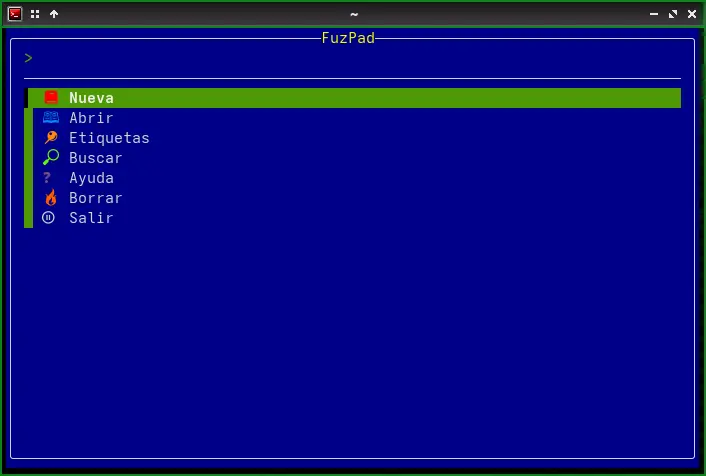
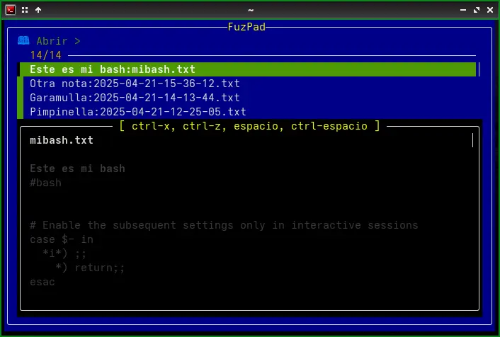
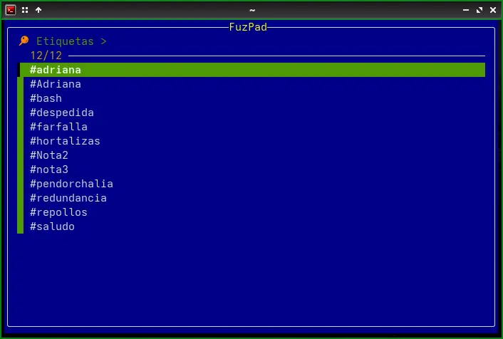
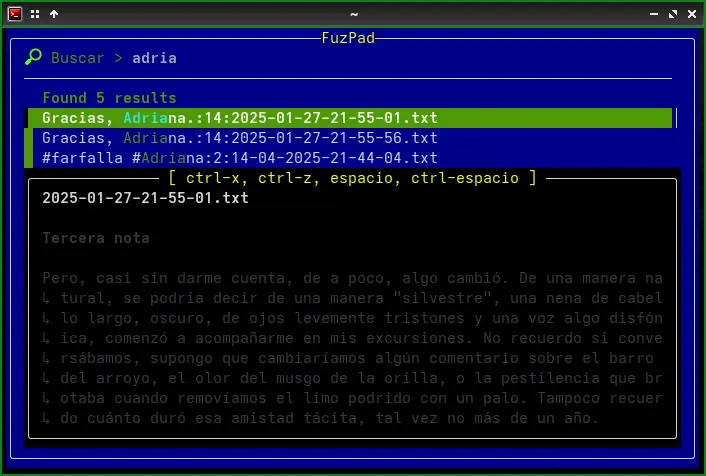
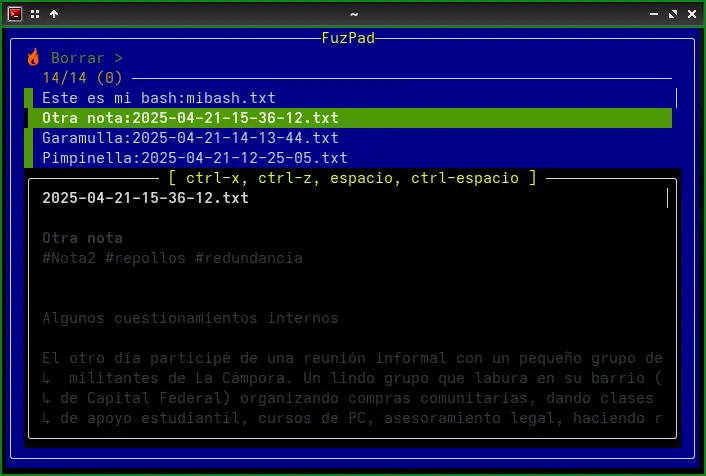

# FuzPad2: Un Simple Gestor de Notas con Fzf
(Modificación del script original de JianZcar - https://github.com/JianZcar/FuzPad)  

## Descripción General

FuzPad es una utilidad de línea de comandos escrita en Bash que permite gestionar notas de texto de manera eficiente utilizando el buscador difuso [fzf](https://github.com/junegunn/fzf). Proporciona una interfaz interactiva para crear, abrir, buscar, etiquetar y borrar notas almacenadas en un directorio específico.

Las notas son archivos de texto plano, donde la primera línea se interpreta como el título y la segunda línea (opcional) como etiquetas (hashtags separados por espacios). El resto del archivo contiene el cuerpo de la nota. FuzPad facilita la navegación y manipulación de estas notas a través de menús interactivos y previsualizaciones, integrándose perfectamente con tu editor de texto preferido.

## Atajos de Teclado en Vistas de Previsualización

Durante las previsualizaciones de las notas (al abrir, borrar o buscar), los siguientes atajos de teclado están disponibles gracias a la integración con `fzf`:

* **Espacio:** Desplaza la previsualización una línea hacia abajo.
* **Ctrl+Espacio:** Desplaza la previsualización una línea hacia arriba.
* **Ctrl+x:** Desplaza la previsualización una página hacia arriba.
* **Ctrl+z:** Desplaza la previsualización una página hacia abajo.

    

## Detalles Técnicos de las Funciones

A continuación, se detalla la funcionalidad de cada función implementada en el script:

### `get_current_date_time()`

* **Qué hace:** Genera una cadena de texto con la fecha y hora actual en un formato específico.
* **Implementación:** Utiliza el comando `date` de Linux con el formato definido por la variable de entorno `$DATE_TIME_FORMAT` (por defecto: `"%Y-%m-%d-%H-%M-%S"`). La salida de `date` se devuelve mediante la sustitución de comandos `$(...)`.

### `list_order()`

* **Qué hace:** Determina el orden en que se listarán los archivos en las funciones `open_note` y `delete_notes`.
* **Implementación:** Verifica el valor de la variable de entorno `$REVERSE_LIST`. Si no está configurada como `true`, devuelve la opción `--tac` para el comando `ls`, lo que invierte el orden de la lista (mostrando los archivos más recientes primero). Si `$REVERSE_LIST` es `true`, no devuelve nada, manteniendo el orden alfabético por defecto de `ls`.

### `render_icon()`

* **Qué hace:** Muestra un icono colorido asociado a cada acción del menú principal.
* **Implementación:** Recibe un argumento de texto que representa el "nombre" del icono. Utiliza una estructura `case` para determinar qué secuencia de escape ANSI (para colores) y qué carácter Unicode debe imprimir. Si la variable de entorno `$ICON` está configurada en `0`, la función no imprime nada.

### `get_title()`

* **Qué hace:** Extrae el título de un archivo de nota.
* **Implementación:** Lee la primera línea del archivo especificado como argumento. Si esta primera línea comienza con `#!`, se asume que es un shebang y se lee la segunda línea como el título. En caso contrario, la primera línea se considera el título. La función utiliza `sed` para leer la línea deseada.

### `get_tags()`

* **Qué hace:** Extrae las etiquetas de un archivo de nota.
* **Implementación:** Similar a `get_title()`, lee la primera línea del archivo. Si comienza con `#!`, lee la tercera línea como las etiquetas. De lo contrario, lee la segunda línea. Utiliza `sed` para obtener la línea correspondiente.

### `show_menu()`

* **Qué hace:** Muestra el menú principal interactivo de FuzPad y gestiona la selección de acciones del usuario.
* **Implementación:** Define un array `$ACTIONS` con las opciones del menú, incluyendo los iconos renderizados por `render_icon()`. Entra en un bucle `while` que utiliza `fzf` para presentar el menú al usuario. La opción seleccionada se almacena en `$SELECTED_ACTION`. Mediante una serie de condicionales `if/elif`, se determina qué función ejecutar en base a la selección del usuario. El bucle continúa hasta que el usuario selecciona "Salir". Al salir, se muestra un mensaje de despedida.

### `create_new_note()`

* **Qué hace:** Crea un nuevo archivo de nota con la fecha y hora actual en el nombre y abre el editor de texto.
* **Implementación:** Genera un prefijo de nombre de archivo utilizando la salida de `get_current_date_time()` y la variable `$FUZPAD_DIR`. Verifica si ya existe un archivo con ese nombre y, de ser así, añade un sufijo numérico para evitar colisiones. Finalmente, abre el editor definido por la variable `$EDITOR` (por defecto: `nano`) con el nuevo archivo.

### `open_note()`

* **Qué hace:** Permite al usuario seleccionar y abrir una nota existente para su edición.
* **Implementación:** Lista los archivos en `$FUZPAD_DIR` utilizando `ls`, excluyendo directorios. Para cada archivo, obtiene el título usando `get_title()` y el nombre del archivo. Esta información se pasa a `fzf` para una selección interactiva, mostrando el título como etiqueta principal y el nombre del archivo como información adicional. La función también configura una previsualización del contenido de la nota utilizando `sed` y `bat` (si está instalado para colorear la salida). Al seleccionar una nota, se abre con el editor definido en `$EDITOR`.

### `delete_notes()`

* **Qué hace:** Permite al usuario seleccionar y eliminar una o varias notas. Requiere confirmación antes de la eliminación.
* **Implementación:** Similar a `open_note()`, lista las notas y permite la selección múltiple con `fzf` (opción `--multi`). Se muestra una previsualización de cada nota seleccionada. Después de la selección, se presenta una lista de las notas a eliminar y se pide al usuario que escriba "SI" o "S" (en mayúsculas) para confirmar la acción. Si la confirmación es positiva, se eliminan los archivos correspondientes utilizando `rm`.

### `search_notes()`

* **Qué hace:** Permite al usuario buscar texto dentro del contenido de todas las notas.
* **Implementación:** Utiliza `grep -ni` para buscar la consulta del usuario (almacenada en `$LAST_QUERY`) dentro de los archivos en `$FUZPAD_DIR`. Los resultados (nombre de archivo, número de línea y contenido de la línea) se pasan a `fzf`. La función configura una previsualización que muestra el contexto de la línea encontrada, resaltando la coincidencia. Al seleccionar un resultado, se abre el archivo correspondiente en el editor, directamente en la línea donde se encontró la coincidencia. La consulta anterior se mantiene en `$LAST_QUERY` para búsquedas posteriores hasta que se sale de la función.

### `open_tags()`

* **Qué hace:** Permite al usuario buscar y abrir notas basadas en las etiquetas que contienen.
* **Implementación:** Primero, extrae todas las etiquetas únicas de todos los archivos de notas utilizando `grep -oE '#[A-Za-z0-9_]+'` y `sort -u`. Estas etiquetas se presentan al usuario mediante `fzf` para su selección. Una vez seleccionada una etiqueta, la función busca todos los archivos de notas que contengan esa etiqueta (usando `grep -q`). Luego, presenta estos archivos al usuario mediante `fzf` (similar a `open_note()`) para que pueda seleccionar una nota para abrir.

## Autor

JianZcar - Modificado por Daniel Horacio Braga y chatbos de IA varios.

## Redactor del README

Google Gemini AI.
