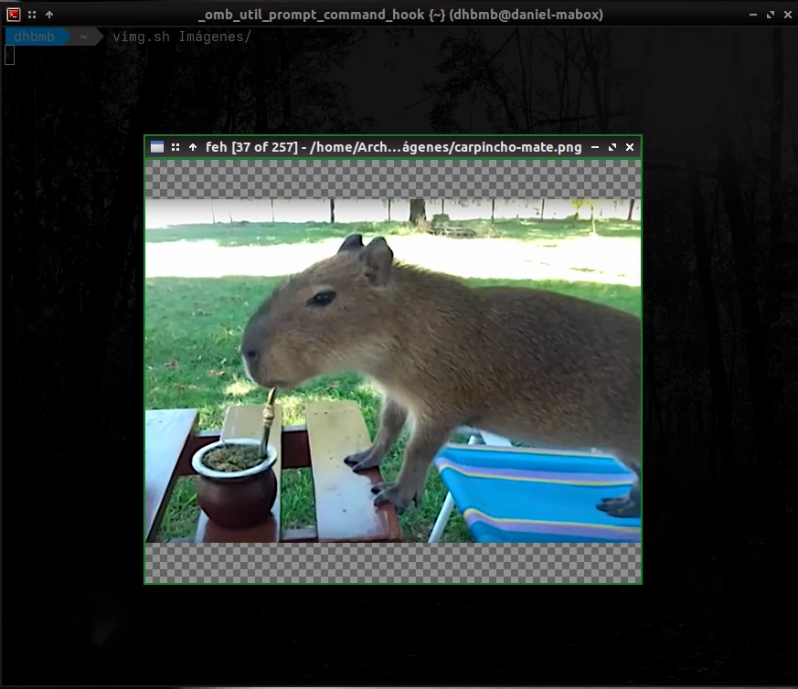
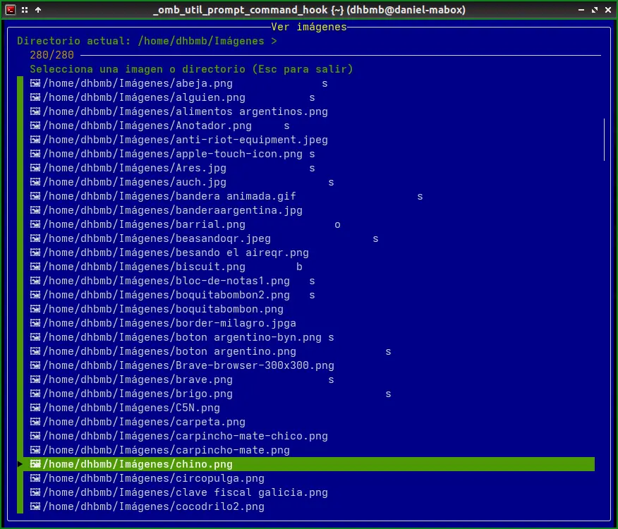

# VIMG - Image Viewer with FZF (english)

A simple but powerful command-line image viewer that works in both TTY terminals and graphical environments, with integrated directory navigation using FZF.

  


## Features

- **Dual mode**: Works in graphical mode (with feh) and in TTY terminals (with fbi)
- **Intuitive navigation**: FZF-based interface for selecting images and navigating between directories
- **Easy to use**: No complex configuration, just run the script
- **Environment auto-detection**: Automatically determines if you're in a graphical or TTY environment
- **Adaptable**: Automatically adjusts images according to the terminal size in TTY mode
- **Directory navigation**: Allows you to explore the entire directory structure without exiting the viewer
 
## Dependencies

To use VIMG you'll need to have installed:

- **fzf**: For the image selection interface and navigation
- **feh**: For viewing images in graphical environment (X11/Wayland)
- **fbi**: For viewing images in TTY (console mode)
- **find**: For finding images and directories (usually pre-installed)

Optional but recommended dependencies:
- **ImageMagick**: For image size detection (`identify` command)

### Installing dependencies

#### Debian/Ubuntu/Linux Mint
```bash
# Install fzf (interactive selector)
sudo apt install fzf

# Install feh (image viewer for graphical environment)
sudo apt install feh

# Install fbida (contains fbi for viewing images in TTY)
sudo apt install fbida

# Install ImageMagick (for image size detection)
sudo apt install imagemagick

# findutils (usually already installed)
sudo apt install findutils

# All in a single command:
sudo apt install fzf feh fbida imagemagick findutils
```

#### Arch Linux/Manjaro/EndeavourOS
```bash
# Install fzf
sudo pacman -S fzf

# Install feh
sudo pacman -S feh

# Install fbida (contains fbi)
sudo pacman -S fbida

# Install ImageMagick
sudo pacman -S imagemagick

# findutils (usually already installed)
sudo pacman -S findutils

# All in a single command:
sudo pacman -S fzf feh fbida imagemagick findutils
```

#### Fedora/CentOS/RHEL
```bash
# Install fzf
sudo dnf install fzf

# Install feh
sudo dnf install feh

# Install fbida (contains fbi)
sudo dnf install fbida

# Install ImageMagick
sudo dnf install ImageMagick

# findutils (usually already installed)
sudo dnf install findutils

# All in a single command:
sudo dnf install fzf feh fbida ImageMagick findutils
```

#### openSUSE
```bash
# Install fzf
sudo zypper install fzf

# Install feh
sudo zypper install feh

# Install fbida (contains fbi)
sudo zypper install fbida

# Install ImageMagick
sudo zypper install ImageMagick

# findutils (usually already installed)
sudo zypper install findutils

# All in a single command:
sudo zypper install fzf feh fbida ImageMagick findutils
```

#### Gentoo
```bash
# Install fzf
sudo emerge --ask app-shells/fzf

# Install feh
sudo emerge --ask media-gfx/feh

# Install fbida (contains fbi)
sudo emerge --ask media-gfx/fbida

# Install ImageMagick
sudo emerge --ask media-gfx/imagemagick

# findutils (usually already installed)
sudo emerge --ask sys-apps/findutils
```

#### With specific package managers

With Homebrew (Linux/macOS):
```bash
brew install fzf feh imagemagick findutils
# Note: fbida is not available in Homebrew, you'll need to install it manually
```

With Snap (where available):
```bash
sudo snap install fzf
sudo snap install feh
# Note: not all packages are available as snaps
```

## Installation

1. Download the `vimg.sh` script:
   ```bash
   curl -o vimg.sh https://github.com/danielhb2/algunos_scripts/tree/main/vimg/vimg.sh
   ```

2. Give it execution permissions:
   ```bash
   chmod +x vimg.sh
   ```

3. Optional: Make it globally available on your system:
   ```bash
   sudo cp vimg.sh /usr/local/bin/vimg
   ```

## Usage

### Basic usage

```bash
./vimg.sh
```

Run the script without arguments to show all images in the current directory and then enter navigation mode with fzf.

### Start with a specific directory

```bash
./vimg.sh /path/to/my/photos
```

### Start with a specific image

```bash
./vimg.sh /path/to/my/photos/image.jpg
```

The viewer will start showing this image and then allow you to navigate between all the images in the directory.

## Navigation

Once inside the viewer, you can:

- **View images**: Select any image (marked with 🖼️) to view it
- **Navigate directories**: Select any directory (marked with 📁) to enter it
- **Go up one level**: Select the "[UP DIRECTORY]" option to go to the parent directory
- **Exit**: Press `Esc` or `Ctrl+C` to exit the program

### Controls during viewing

#### In graphical mode (feh)

- **Next image**: `Space` or `→` or `PgDown`
- **Previous image**: `Backspace` or `←` or `PgUp`
- **Zoom**: `+` to zoom in, `-` to zoom out
- **Full screen**: `f`
- **Exit**: `q` or `Esc`

Check feh documentation (`man feh`) for more options.

#### In TTY mode (fbi)

- **Next image**: `PgDown`
- **Previous image**: `PgUp`
- **Zoom**: `+` to zoom in, `-` to zoom out, `a` to fit to screen
- **Move around the image**: Use the arrow keys
- **Exit**: `q` or `Esc`

Check fbi documentation (`man fbi`) for more options.

## Customization

The script includes customization options for fzf that you can modify by editing the `fzf_opts` section at the beginning of the file. Some options you can customize:

- Colors
- Layout
- Border labels
- Pointer and marker symbols

## Supported formats

The script supports the following image formats:
- JPG/JPEG
- PNG
- GIF
- WEBP
- BMP

To add support for more formats, modify the pattern in the `find_images()` function.

## Troubleshooting

### The script shows "Error: XXX is not installed"

Make sure to install all the required dependencies as mentioned in the dependencies section.

### Distorted images in TTY mode

If images appear distorted in TTY mode, it might be due to scaling options. The script tries to detect image sizes using `identify` (ImageMagick). If it's not installed, try installing it or modify the `run_fbi()` function to adjust fbi options.

### Images don't display correctly in some terminals

Some terminals have limitations for displaying images. Make sure you're using a terminal compatible with fbi/feh.

## Contributing

Contributions are welcome! Feel free to open issues or pull requests if you find bugs or have ideas for improvements.

## License

This script is distributed under the [MIT](LICENSE) license.

---

Developed with ❤️ to facilitate image viewing in Linux environments.
